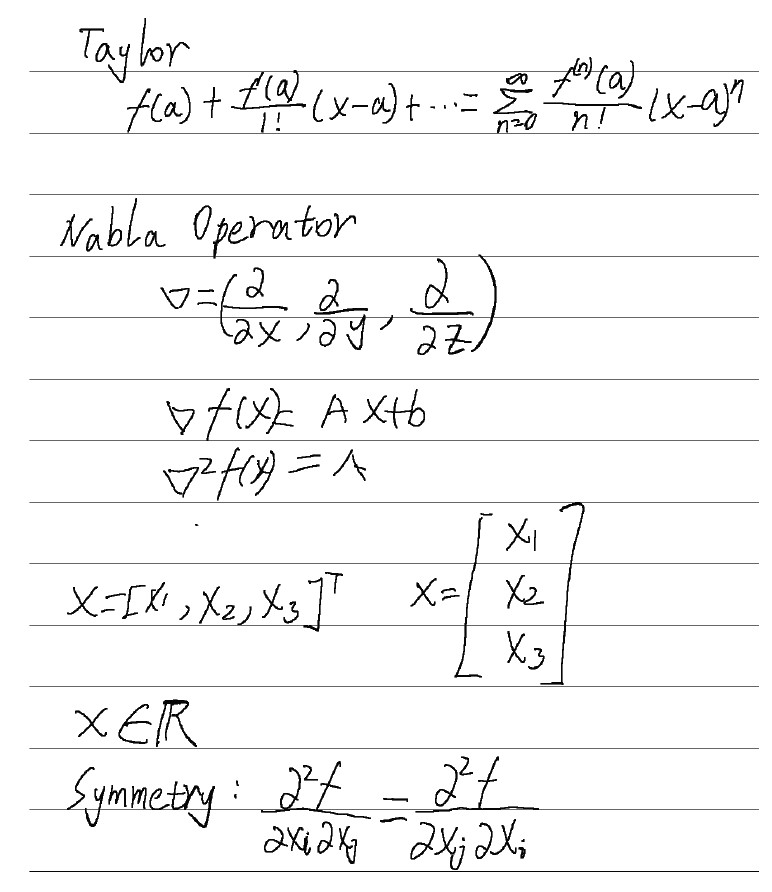
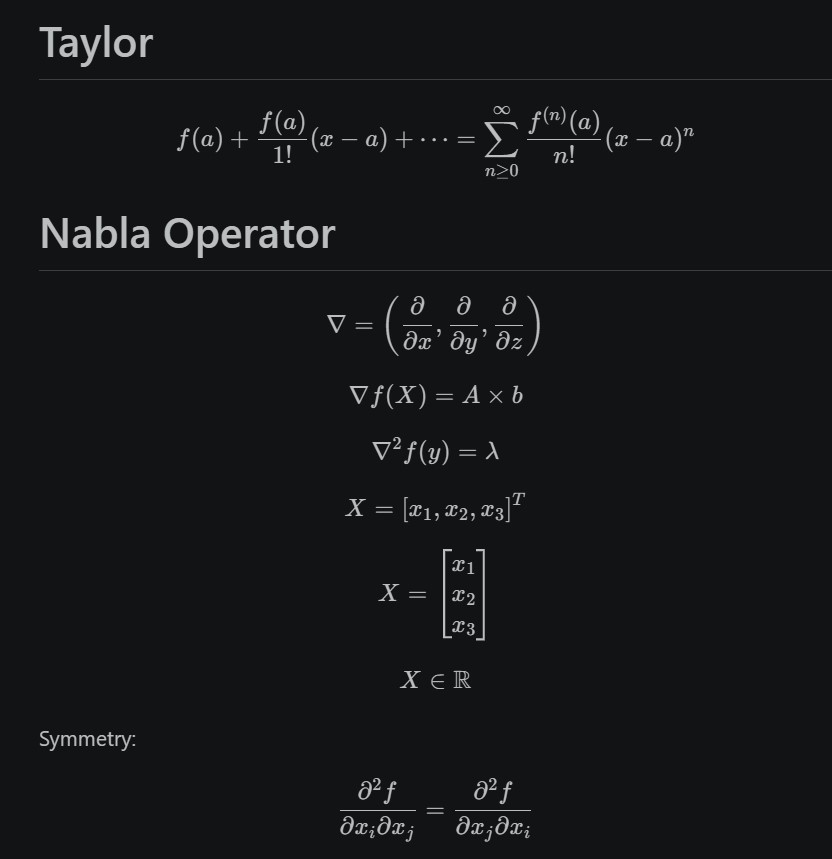
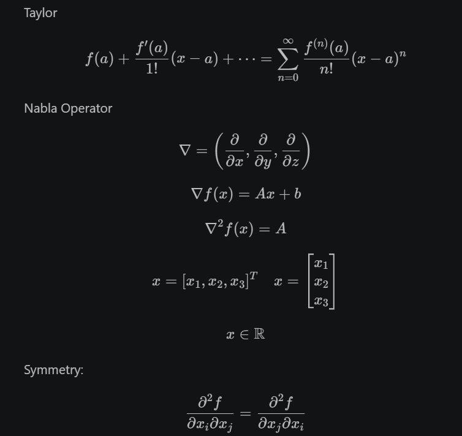

# pdf-to-md - 手写笔记转 Markdown

将手写笔记智能转换为 Markdown，完美保留公式和排版。设计为 Obsidian 插件，实现无缝一键转换。


**中文** | **[English](README.md)**

---

## 🎉 Obsidian 插件

一键将 Obsidian 中的手写 PDF 转换为 Markdown！

**核心功能：**
- 📄 右键 PDF → "Convert to Markdown"
- 🤖 支持 GPT-4o, GPT-5.4, 阿里千问 (Qwen) 以及谷歌 Gemini
- 📊 实时进度提示，显示转换状态和耗时
- 🔐 API Key 安全管理（只读环境变量检测）
- ⚙️ 可配置 DPI、超时、重试、文件冲突处理

### 插件安装

**方式一：Obsidian 插件市场（推荐）**
1. 打开 Obsidian → 设置 → 社区插件
2. 搜索 "pdf-to-md"
3. 点击安装并启用

**方式二：手动安装**
1. 从 [GitHub Releases](https://github.com/kkbin505/pdf-to-md/releases) 下载最新版本
2. 将文件复制到你的 Vault：
   ```
   <你的Vault>/.obsidian/plugins/pdf-to-md/
   ├── main.js
   ├── pdf.worker.min.js
   └── manifest.json
   ```
3. 重启 Obsidian 并启用插件

### 插件快速开始

**1️⃣ 配置环境变量**

**重要：** 本插件不在本地存储 API Key，只从环境变量读取。这样更安全。

**获取 API Key：**
- **阿里千问（推荐）：** https://dashscope.console.aliyun.com/apiKey
- **OpenAI：** https://platform.openai.com/api-keys
- **谷歌 Gemini：** https://aistudio.google.com/

**设置环境变量：**

**Windows (PowerShell - 以管理员身份运行)：**
```powershell
# 阿里千问
[System.Environment]::SetEnvironmentVariable('DASHSCOPE_API_KEY', 'sk-xxx...', 'User')

# OpenAI
[System.Environment]::SetEnvironmentVariable('OPENAI_API_KEY', 'sk-proj-xxx...', 'User')

# 谷歌 Gemini
[System.Environment]::SetEnvironmentVariable('GEMINI_API_KEY', 'AIzaSyxxx...', 'User')
```

**Mac/Linux：**
```bash
# 编辑 ~/.bashrc 或 ~/.zshrc (Mac 用户用 ~/.zprofile)，添加：
export DASHSCOPE_API_KEY='sk-xxx...'
export OPENAI_API_KEY='sk-proj-xxx...'
export GEMINI_API_KEY='AIzaSyxxx...'

# 保存后，重新加载配置：
source ~/.bashrc  # 或 source ~/.zshrc
```

**⚠️ 完全重启 Obsidian**（不只是刷新插件，需要彻底关闭后重新打开）。

**2️⃣ 选择 AI 模型**

打开 Obsidian 设置 → PDF to Markdown：
- 在统一的 **Model** 下拉菜单中直接选择你想要使用的模型（支持各种 GPT-4o、GPT-5.4、千问以及 Gemini 模型）。

**3️⃣ 转换 PDF**

1. 在 Obsidian 文件浏览器中找到你的 PDF
2. 右键 → **"Convert to Markdown"**
3. 等待转换完成（进度条显示状态）
4. 转换好的 `.md` 自动保存在同目录

```
示例：
输入:  my_notes.pdf
输出:  my_notes_qwen.md         (使用千问)
       my_notes_gpt-5.4.md      (使用 GPT 5.4)
```



### Qwen



### GPT



### 插件设置详解

| 选项 | 默认值 | 说明 |
|---|---|---|
| **Model** | 千问 VL Max | 在下拉菜单中选择要使用的 AI 模型 |
| **API Key 状态** | 自动检测 | 显示环境变量配置状态（只读） |
| **PDF 渲染 DPI** | 200 | 更高的 DPI 质量更好但速度更慢（100-400） |
| **API 超时** | 60 秒 | API 请求的最大等待时间 |
| **最大重试次数** | 3 | 请求失败时的重试次数 |
| **文件冲突处理** | 按模型命名 | 输出文件已存在时的处理方式 |

**文件冲突处理策略：**
- **覆盖：** 直接覆盖已存在的文件（⚠️ 会丢失之前的内容）
- **跳过：** 如果文件已存在则不生成新文件
- **时间戳：** 在文件名中添加时间戳
- **按模型命名（推荐）：** 在文件名中添加模型名称（如 `my_notes_qwen.md`）

---

## 📊 实际效果

查看不同模型对同一输入的真实输出：
- [千问结果](example/Scratch_qwen.md) - 性价比最优
- [OpenAI 结果](example/Scratch_openai.md) - 准确度最高
- [原始 PDF](example/Scratch.pdf) - 输入示例

---

## 📖 开发背景

最近在深入学习控制理论，虽然非常喜欢**讯飞本 (iFlytek Smart Notebook)** 带来的手写体验，但在将笔记整理到 **Obsidian** 时遇到了巨大障碍：原装软件对数学公式的识别极不友好，导致整理效率低下。

为了解决这个痛点，我开发了这个插件。基于 **千问-VL**、**GPT-4o/GPT-5.4** 和 **Gemini**，实现：
- **混合排版精准识别**：完美处理文字与复杂公式的混合
- **LaTeX 数学公式**：将方程式转换为清晰的 LaTeX 代码（`$...$` 和 `$$...$$`），在 Obsidian 中直接完美渲染
- **灵活与低成本**：在 Obsidian 内部一键切换超高性价比（千问 ¥0.00345/页）或极速云端模型

---

## 🔐 安全与隐私

✅ **API Key 安全**：
- 仅从环境变量读取 - **不存储到磁盘**
- 设置中掩码显示
- 无硬写、无本地存储

✅ **数据隐私**：
- PDF 仅在转换时发送到 AI API
- 插件不存储或缓存你的文件
- 完全掌控你的数据

✅ **开源透明**：
- 代码完全开源，GitHub 可审查
- 无后门，无追踪，无数据收集

---

## ❓ 常见问题

### Q: 插件提示"API Key not configured"？
**A:** API Key 没有从环境变量中读取到。检查：
- ✓ 环境变量是否正确设置（`DASHSCOPE_API_KEY`、`OPENAI_API_KEY`、`GEMINI_API_KEY`）
- ✓ 重启了 Obsidian 吗？（必须完全重启，不只是刷新插件）
- ✓ 变量名是否拼写正确（区分大小写）

### Q: 转换失败，显示"API 错误"？
**A:** 检查以下项：
- ✓ API Key 是否有效且有足够的额度
- ✓ 网络连接是否正常
- ✓ 账户配额是否已用完

### Q: 转换超时？
**A:** 尝试以下方案：
- 1. 增加超时时间（设置 → 60秒 → 90秒）
- 2. 降低 DPI（200 → 150）使转换更快
- 3. 检查网络速度
- 4. 尝试换用更快的模型（千问 VL Max 或 GPT-4o Mini）

### Q: 为什么输出结果有时不完美？
**A:** 质量受以下因素影响：
- 📄 PDF 的清晰度（扫描 vs 拍照）
- ✍️ 手写笔迹 of 整理度
- 🧮 公式的复杂程度
- 🤖 模型的能力

**改进建议：**
- 提高 DPI 以获得更清晰的渲染
- 使用更强的模型（如 GPT-4o 或 GPT-5.4 通常更准确）
- 接受少量错误并手动修正

### Q: 输出的 LaTeX 公式无法在 Obsidian 中渲染？
**A:** 需要在 Obsidian 中启用数学渲染：
1. 安装并启用数学渲染（Obsidian 默认原生支持 MathJax 渲染，确保在设置 → 外观中未禁用）
2. 刷新或重新载入 Obsidian

---

## 🤝 贡献

欢迎提交 Issue 和 Pull Request！

---

## 📄 开源协议

MIT License

---

**喜欢这个项目？请在 GitHub 给个 Star ⭐ 吧！**
